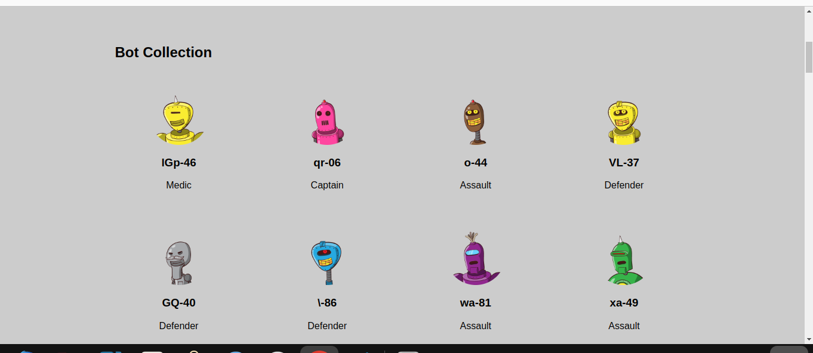

# codechalengeweek2
## Code challenge Two
## Author- Collins Kipkorir
## Bot Battle App
The Bot Battle App is a web application where users can enlist bots into their army and battle them against each other. The app allows users to view a collection of bots, enlist them into their army, and filter and sort the bots based on various attributes.

## Features
View all bots in the collection and their details.
Enlist bots into your army.
Filter bots by their class (Support, Medic, Assault, Defender, Captain, Witch).
Sort bots by their health, damage, or armor.
Remove enlisted bots from the collection and add them to your army.
## Getting Started
To run the Bot Battle App locally, follow these steps:

Install the required dependencies using npm install.
Start the development server with npm start.
Open your web browser and visit http://localhost:8001 to view the app.
## Dependencies
The Bot Battle App uses the following dependencies:

React.js
json-server

## SCREENSHOTS 

## Support and contact details 
To make a contribution to the code used or any suggestions you can click on the contact link and email me your suggestions.
    • Email: kipkorirc583@gmail.com
## License
 Copyright (c) 2023 Collins Kipkorir.

Permission is hereby granted, free of charge, to any person obtaining a copy of this software and associated documentation files , to deal in the Software without restriction, including without limitation the rights to use, copy, modify, merge, publish, distribute, sublicense, and/or sell copies of the Software, and to permit persons to whom the Software is furnished to do so, subject to the following conditions:
The above copyright notice and this permission notice shall be included in all copies or substantial portions of the Software.
THE SOFTWARE IS PROVIDED "AS IS", WITHOUT WARRANTY OF ANY KIND, EXPRESS OR IMPLIED, INCLUDING BUT NOT LIMITED TO THE WARRANTIES OF MERCHANTABILITY, FITNESS FOR A PARTICULAR PURPOSE AND NONINFRINGEMENT. IN NO EVENT SHALL THE AUTHORS OR COPYRIGHT HOLDERS BE LIABLE FOR ANY CLAIM, DAMAGES OR OTHER LIABILITY, WHETHER IN AN ACTION OF CONTRACT, TORT OR OTHERWISE, ARISING FROM, OUT OF OR IN CONNECTION WITH THE SOFTWARE OR THE USE OR OTHER DEALINGS IN THE SOFTWARE.
